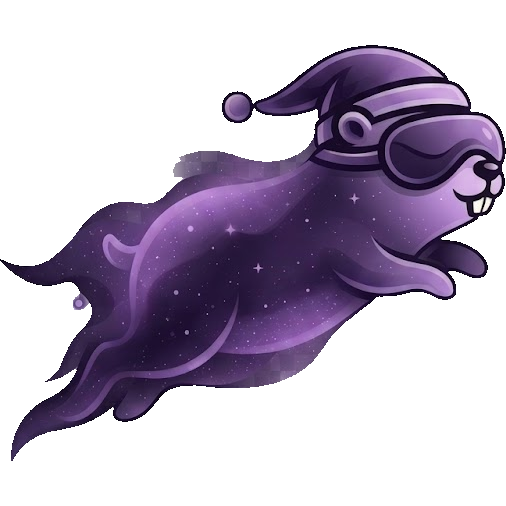

<div align="center">



# Nocturn

**A personal AI assistant that works on its own — and stops for your approval, on your phone,
before it does anything you can't take back.**

One Go binary. No cloud, no database, no runtime to install.

[](https://efuturetoday.github.io/nocturn)
[](go.mod)
[](LICENSE)
[](https://github.com/efuturetoday/nocturn/actions/workflows/ci.yml)
[](#)
[](agentkit/go.mod)

**[📖 Read the documentation →](https://efuturetoday.github.io/nocturn)**

</div>

---

## Why this exists

I wanted agents doing real work on my own life — my mail, my calendar, my files. Every way to do
that today starts the same way: hand your credentials and your data to somebody else's machine and
hope their isolation holds. Once it has left your home it is exposed to a breach you will never hear
about, a policy change you never agreed to, and a model you cannot inspect.

That trade is the wrong shape. What makes a personal assistant useful is that it reaches your real
accounts — and that is exactly what makes it dangerous. So Nocturn keeps both halves at home: the
model never holds a credential, and nothing irreversible happens until a human approves it, on a
second device an attacker is not holding.

Which is where the name comes from. The agents work at night, unattended, on a schedule. The point
is sleeping through it without wondering whether the mailbox is still there in the morning.

## Quickstart

```bash
go build ./cmd/nocturn        # one binary, no runtime, nothing else to install
cp .env.example .env          # OPENAI_BASE_URL / _MODEL / _API_KEY — any OpenAI-compatible endpoint

./nocturn                     # terminal chat
./nocturn serve               # the daemon your phone and your satellites talk to
```

Nocturn ships no model; point it at one you control. Everything it knows lives in a `nocturn-data/`
folder next to wherever you ran it — no database, nothing scattered through your home directory.

📱 **The companion app** is what answers an approval when you are nowhere near the machine.
A TestFlight link lands here with the public beta.

📖 **[The documentation](https://efuturetoday.github.io/nocturn)** covers the rest: full setup, the
permission model, writing plugins, connecting accounts, agents on a schedule, the wire protocol.
This page stays short on purpose — what is below is only the part you would want before deciding to
read further.

---

## The two threats, and why one wall can't stop both

For a security product the threat model *is* the product. Nocturn's design falls out of one
observation: an assistant faces two independent threats that need two different defenses.

**1. Malicious code.** A skill or plugin you install is hostile, or a good one is compromised
upstream. Running with your privileges, it reads your disk and opens sockets directly.
→ **The sandbox.** Untrusted code runs in WebAssembly at *zero* authority. Capability it was not
handed is capability it cannot name.

**2. Prompt injection.** The model reads a web page, an email, a message, and that content carries
an instruction. No malicious code is involved at all — the injection rides on tools you granted on
purpose, and its goal is almost always to **exfiltrate**.
→ **Starve it, then gate it.** The model never holds your secrets, so there is nothing to hand over.
Everything it *can* still call goes through a gate, and anything outbound or irreversible waits for
an out-of-band approval.

The tempting shortcut — "just sandbox everything" — does not work. The sandbox cannot stop
injection, because the injection uses the very tools the sandboxed code is *allowed* to call: the
call is authorized, the intent is not. And in-band approval cannot stop it either. **A prompt that
appears in the session the injection already captured can be answered by the injection.** Consent
has to come from somewhere it cannot reach. That is why the second device is mandatory rather than a
convenience.

→ [The full threat model](https://efuturetoday.github.io/nocturn/architecture/threat-model/)

## Architecture

Two halves that are deliberately not allowed to blur.

**`agentkit/` — the engine.** Its own Go module whose `go.mod` has **no `require` block at all**. An
LLM-agnostic turn loop, immutable tool and skill sets, sub-agents, event streaming, per-turn and
per-tree guards. Everything external is a port — `LLM`, `Tool`, `Logger`, `Store`. The core is
**policy-blind**: it knows nothing about permissions, because gating belongs in a wrapper on top,
never inside the component the model's output flows through.

**`internal/` — Nocturn.** The security boundary the engine has no opinion about: the wazero sandbox,
the encrypted vault and its boundary injector, the gated tools, out-of-band approval, and
composition per workspace.

Two axes of control stay apart on purpose: **which** tools an agent has at all is a `ToolSet`, bound
once and statically. **What** a tool may *do* is the gate — per action, asked when risky, remembered
at the scope you picked.

→ [Request flow](https://efuturetoday.github.io/nocturn/architecture/request-flow/) ·
[The two halves](https://efuturetoday.github.io/nocturn/architecture/agentkit/) ·
[Cage and gate](https://efuturetoday.github.io/nocturn/reference/gate/) ·
[ADRS.md](ADRS.md) — eleven decision records

---

## 🧠 Development methodology: an agentic SDLC

This project is also a case study in AI-driven engineering, and the interesting part is not that an
agent wrote code. It is that **the process was compiled into the repository** rather than promised
in a README.

`.claude/settings.json` is committed, and it holds two hooks that every contributor — human or
model — runs into:

```jsonc
// PreToolUse — a commit with unreviewed Go in the index is DENIED, not warned about.
"matcher": "Bash", "if": "Bash(git commit*)"
//   → staged *.go files are hashed; unless that exact diff has been through the Go
//     review skills (Effective Go + the Google Go Style Guide, cited by rule and file:line),
//     the commit does not happen. A stamp over the diff hash means the same content
//     is never blocked twice.

// PostToolUse — a commit touching only internal/ or cmd/ BLOCKS afterwards
//   → until the affected documentation is updated, or the omission is justified in writing.
```

That is the difference between *"I reviewed carefully"* and *review being a precondition for a
commit existing at all*. Every commit in this history passed both gates. The same idea runs through
`docs/AGENTS.md`, whose one rule is **"this site documents the code in this repository, not a design
of it"**, and through `CLAUDE.md` §6, a running list of pitfalls actually hit — so a mistake is paid
for once.

**The division of labour.** Architecture, security boundaries, the threat model, the ADRs, and
review were mine. Implementation, tests, documentation and the mechanical work happened inside those
constraints. The constraints came first and are in the repository as artifacts.

**What that produced**, all of it checkable from a clone:

| | |
|---|---|
| **381 commits** in 23 days, **374** carrying a `Co-Authored-By: Claude` trailer | `git log` |
| **22,037** lines of Go — against **23,758** lines of test | `git ls-files '*.go' \| xargs wc -l` |
| **809** test functions, the whole suite green under `-race` | `go test -race ./...` |
| **`agentkit/gate` at 100 %** statement coverage — the permission layer | `go test -cover` |
| sandbox 90.9 % · secret 90.4 % · hitl 91.4 % · agentkit 92.9 % · auth 93.2 % | `go test -cover` |
| **Zero** third-party dependencies in the engine | [`agentkit/go.mod`](agentkit/go.mod) |
| CGO-free, ~18 MB, six targets from one source tree | [CI](.github/workflows/ci.yml) |
| 4,014 lines of C (ESP32 firmware) · 4,834 lines of Angular/iOS app | one protocol, three clients |

The honest caveat: this pace is only available because the constraints were unusually explicit. The
ADRs, the pitfalls file and the two hooks are not documentation *about* the work — they are the
input that made the work converge.

---

## Status

**Built and tested:** the engine and its gate, the WASM sandbox, the secret vault with boundary
injection and bidirectional leak scanning, out-of-band approvals over WebSocket and APNs, remote MCP,
plugins, skills, memory, scheduled agents, the iOS companion app.

**Experimental — expect it to move:** spoken sessions and speaker recognition, the latter a pure-Go
ONNX subset with no CGO running a WeSpeaker ResNet34. Recognition chooses **context and address,
never permission** — speech is a channel like the chat, where nobody authenticates the typist either.

**Next:** retrieval over a workspace's documents; a hosted push relay, so waking a phone stops
requiring your own Apple Developer account — safe to hand off precisely because a push carries no
authority and no content; an Android app; extracting `agentkit` into its own repository; Ed25519
signing for skills and plugins.

**Deliberately not built:** an ambient `exec` tool. See [ADR-6](ADRS.md) — every step toward a
general coding agent erodes the one thing this design is for.

## Reading further

- **[Documentation](https://efuturetoday.github.io/nocturn)** — guides, reference, architecture
- **[ADRS.md](ADRS.md)** · **[agentkit/DOCS.md](agentkit/DOCS.md)** · **[CLAUDE.md](CLAUDE.md)**
- **[CONTRIBUTING.md](CONTRIBUTING.md)** · **[SECURITY.md](SECURITY.md)**

## License

[Apache-2.0](LICENSE).
