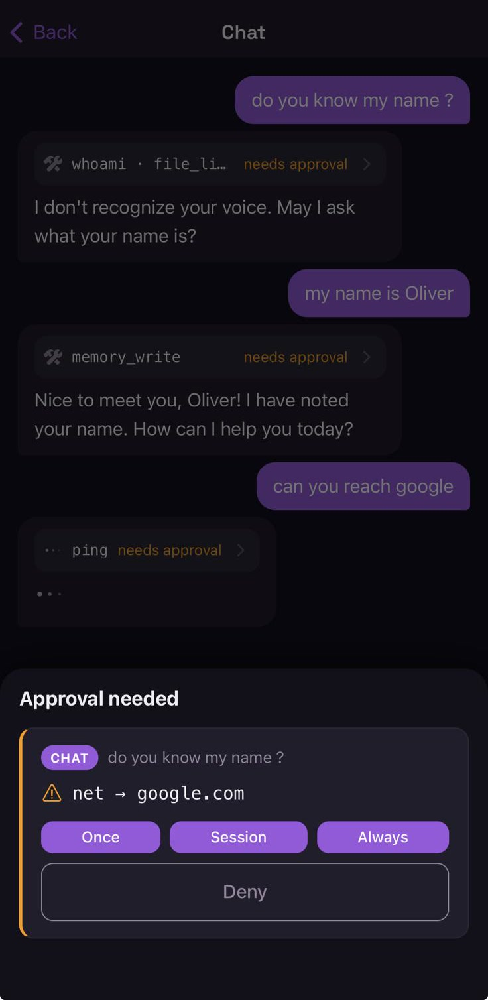

<div align="center">


# Nocturn

**A personal AI assistant that works on its own — and stops for your approval, on your phone,
before it does anything you can't take back.**

One Go binary. No cloud, no database, no runtime to install.

[](https://efuturetoday.github.io/nocturn)
[](go.mod)
[](LICENSE)
[](https://github.com/efuturetoday/nocturn/actions/workflows/ci.yml)
[](#)
[](agentkit/go.mod)

**[📖 Read the documentation →](https://efuturetoday.github.io/nocturn)**

</div>

---

## Why this exists

I wanted agents doing real work on my own life — my mail, my calendar, my files. Running an agent on
your own machine is not the hard part; several tools do that. The hard part starts the moment it
becomes useful, which is the moment it holds real credentials and is allowed to act on them.

Two things follow, and they are the whole design.

**The model never holds the credential.** Tokens live in an encrypted vault the host owns, and are
injected at the network boundary. The model learns that a secret *exists*; it never sees the value.
There is nothing in the conversation to steal, so an injection that talks the model into
exfiltrating has nothing to carry.

**No host capability without the gate.** Not for a plugin, not for a skill, not for a script the
model just wrote. Foreign code runs in WebAssembly at zero authority — no filesystem, no sockets, no
clock — and every capability is an explicitly handed host function rather than something the sandbox
is trusted not to reach for. Each of those calls is then checked per action, and anything
irreversible waits for a yes that has to come from a second device.

What this does *not* claim: the model endpoint you point it at sees your conversation. That is true
of every assistant including this one, and [SECURITY.md](SECURITY.md) says so plainly instead of
implying otherwise. What it does claim is narrower and checkable — that between the model deciding
to do something and it happening, there is a boundary the model cannot argue its way through.

Which is where the name comes from. The agents work at night, unattended, on a schedule. The point
is sleeping through it without wondering whether the mailbox is still there in the morning.

## Quickstart

```bash
go build ./cmd/nocturn        # one binary, no runtime, nothing else to install
cp .env.example .env          # OPENAI_BASE_URL / _MODEL / _API_KEY — any OpenAI-compatible endpoint

./nocturn                     # terminal chat
./nocturn serve               # the daemon your phone and your satellites talk to
```

Nocturn ships no model; point it at one you control. Everything it knows lives in a `nocturn-data/`
folder next to wherever you ran it — no database, nothing scattered through your home directory.

📱 **The companion app** is what answers an approval when you are nowhere near the machine.
A TestFlight link lands here with the public beta.

📖 **[The documentation](https://efuturetoday.github.io/nocturn)** covers the rest: full setup, the
permission model, writing plugins, connecting accounts, agents on a schedule, the wire protocol.
This page stays short on purpose — what is below is only the part you would want before deciding to
read further.

---

## The two threats, and why one wall can't stop both

For a security product the threat model *is* the product. Nocturn's design falls out of one
observation: an assistant faces two independent threats that need two different defenses.

**1. Malicious code.** A skill or plugin you install is hostile, or a good one is compromised
upstream. Running with your privileges, it reads your disk and opens sockets directly.
→ **The sandbox.** Untrusted code runs in WebAssembly at *zero* authority. Capability it was not
handed is capability it cannot name.

**2. Prompt injection.** The model reads a web page, an email, a message, and that content carries
an instruction. No malicious code is involved at all — the injection rides on tools you granted on
purpose, and its goal is almost always to **exfiltrate**.
→ **Starve it, then gate it.** The model never holds your secrets, so there is nothing to hand over.
Everything it *can* still call goes through a gate, and anything outbound or irreversible waits for
an out-of-band approval.

The tempting shortcut — "just sandbox everything" — does not work. The sandbox cannot stop
injection, because the injection uses the very tools the sandboxed code is *allowed* to call: the
call is authorized, the intent is not. And in-band approval cannot stop it either. **A prompt that
appears in the session the injection already captured can be answered by the injection.** Consent
has to come from somewhere it cannot reach. That is why the second device is mandatory rather than a
convenience.

→ [The full threat model](https://efuturetoday.github.io/nocturn/architecture/threat-model/)

<div align="center">




*What an approval looks like where the injection cannot reach it — and the workspace on the same
device.*

</div>

## Architecture

Two halves that are deliberately not allowed to blur.

**`agentkit/` — the engine.** Its own Go module whose `go.mod` has **no `require` block at all**. An
LLM-agnostic turn loop, immutable tool and skill sets, sub-agents, event streaming, per-turn and
per-tree guards. Everything external is a port — `LLM`, `Tool`, `Logger`, `Store`. The core is
**policy-blind**: it knows nothing about permissions, because gating belongs in a wrapper on top,
never inside the component the model's output flows through.

**`internal/` — Nocturn.** The security boundary the engine has no opinion about: the wazero sandbox,
the encrypted vault and its boundary injector, the gated tools, out-of-band approval, and
composition per workspace.

Two axes of control stay apart on purpose: **which** tools an agent has at all is a `ToolSet`, bound
once and statically. **What** a tool may *do* is the gate — per action, asked when risky, remembered
at the scope you picked.

→ [Request flow](https://efuturetoday.github.io/nocturn/architecture/request-flow/) ·
[The two halves](https://efuturetoday.github.io/nocturn/architecture/agentkit/) ·
[Cage and gate](https://efuturetoday.github.io/nocturn/reference/gate/) ·
[ADRS.md](ADRS.md) — eleven decision records

---

## How this was built

I did the architecture, the security boundaries, the threat model, the ADRs and the review. The
implementation, the tests and the documentation happened inside those constraints. The constraints
came first, and [`ADRS.md`](ADRS.md) is where most of them were written down before the code they
govern.

**Where that got to**, all of it verifiable from a clone:

| | | |
|---|---|---|
| **409** commits in 23 days, **402** with a `Co-Authored-By: Claude` trailer | | `git log` |
| **24,066** lines of Go — against **25,268** lines of test | | `wc -l` |
| **864** test functions, green under `-race` | | `go test -race ./...` |
| **`agentkit/gate` 100 %** statement coverage | the permission layer itself | `go test -cover` |
| auth 94.2 % · agentkit 92.9 % · hitl 91.4 % · sandbox 90.9 % · secret 90.4 % | the parts that hold the boundary | `go test -cover` |
| **zero** third-party dependencies in the engine | no `require` block at all | [`agentkit/go.mod`](agentkit/go.mod) |
| CGO-free, ~18 MB, six targets | built on every push | [CI](.github/workflows/ci.yml) |
| 4,014 lines of C · 4,834 lines of Angular | firmware and app, one protocol | — |

The caveat worth stating: this only works because the constraints were unusually explicit. Take the
ADRs, the pitfalls file and the two hooks away and you get a fast pile of plausible code. They are
not documentation *about* the work — they are what made it converge.

## Status and roadmap

| | | |
|---|---|---|
| **Engine** — turn loop, ports, immutable tool sets, sub-agents, guards | ✅ | zero deps |
| **The gate** — per-action policy, durable grants, approver port | ✅ | 100 % covered |
| **WASM sandbox** — foreign code at zero authority, brokered imports | ✅ | |
| **Secret vault** — boundary injection, bidirectional leak scanning | ✅ | |
| **Out-of-band approvals** — WebSocket, APNs wake, first answer wins | ✅ | |
| **iOS companion app** — the second device | ✅ | TestFlight with the beta |
| **Remote MCP** — HTTPS servers, host-injected OAuth | ✅ | stdio deliberately not |
| **Plugins & skills** — sandboxed, manifest reviewed without running it | ✅ | |
| **Memory** — durable notes, catalog folded into every prompt | ✅ | |
| **Agents on a schedule** — cron, `strict` by default | ✅ | |
| **Knowledge** — document search, hybrid, reconciled every minute | 🆕 | newest, least worn in |
| **Voice & speaker recognition** — live audio, ESP32 satellite | 🚧 | expect it to move |
| **Hosted push relay** — so a phone can be woken without your own Apple account | 📋 | safe to hand off: a push carries no authority |
| **Android app** | 📋 | a build target, not a rewrite |
| **`agentkit` in its own repository** | 📋 | |
| **Ed25519 signing** for skills and plugins | 📋 | |
| **Local embeddings** — retrieval without a remote provider | 📋 | needs a transformer in `internal/onnx` |
| **Keychain vault backend**, interactive unlock | 📋 | replaces a passphrase in the environment |
| **`exec` tool** | ❌ | see [ADR-6](ADRS.md) — it erodes the one thing this design is for |

Two of those deserve a sentence rather than a row.

**Voice and speaker recognition** work end to end and are covered by tests — they are simply the
newest thing here, and the wire protocol is still moving. Recognition chooses **context and address,
never permission**: speech is a channel like the chat, where nobody authenticates the typist either.

**Knowledge** searches documents you file in a workspace, and indexing sends them to an embedding
provider. That is stated where you would look for it rather than in a footnote, because it is the
one part of this design that hands your data to somebody else on purpose.

## Reading further

- **[Documentation](https://efuturetoday.github.io/nocturn)** — guides, reference, architecture
- **[ADRS.md](ADRS.md)** · **[agentkit/DOCS.md](agentkit/DOCS.md)** · **[CLAUDE.md](CLAUDE.md)**
- **[CONTRIBUTING.md](CONTRIBUTING.md)** · **[SECURITY.md](SECURITY.md)**

## License

[Apache-2.0](LICENSE).
