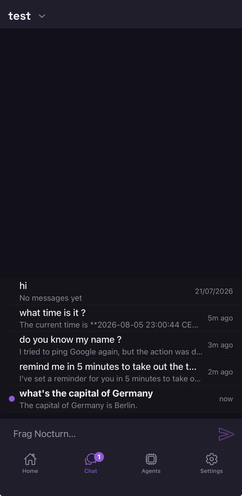
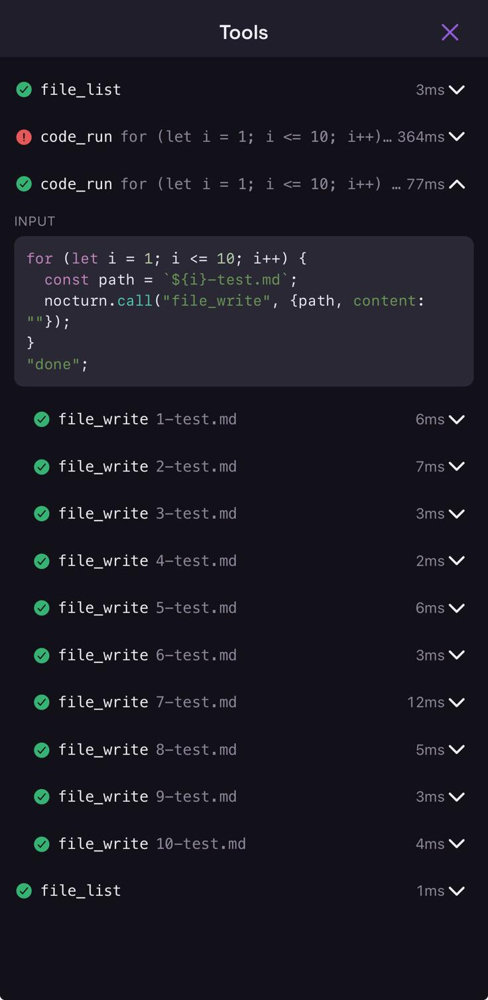
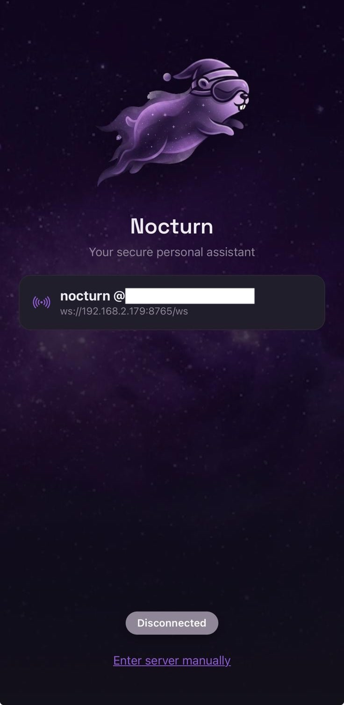

<div align="center">


# Nocturn

**An AI assistant that works autonomously — but stops to ask for your approval on your phone before
doing anything you can't take back.**

One single Go binary. No cloud, no database, no runtime required.

[](https://efuturetoday.github.io/nocturn)
[](go.mod)
[](LICENSE)

**[📖 Read the documentation →](https://efuturetoday.github.io/nocturn)**

</div>

---

> [!WARNING]
> **This is an alpha.** Expect bugs, and expect change — everything here is still moving: the UI, the
> UX, the tooling, the wire protocol and the feature set alike. Some of that movement will break what
> you set up. The security boundaries are the part that gets the scrutiny; everything around them is
> going to get better fast, which is another way of saying it is not finished. Issues and pull
> requests are exactly what this phase is for.

## ⚡ Why is Nocturn different?

Most AI agents have full access to your system by default simply because they run on Node or Python.
Nocturn flips this principle: a capability is *absent* until you hand it over, never present until
something denies it. It provides a solid technical foundation that harmonizes the execution of
plugins and scripts while keeping boundaries strictly enforced.

* **Your smartphone is the gatekeeper:** Before the AI reaches the network or modifies a file —
  sending that email, writing that document — an approval request pops up in the companion app on
  your phone. You retain absolute control.
* **Zero-Trust Sandbox:** Foreign code and AI-generated scripts run inside an isolated WebAssembly
  (WASM) sandbox. No filesystem access, no network access, no environment variables — unless
  explicitly handed over.
* **Secrets stay secret:** The language model never sees your API keys or passwords, yet it can still
  drive an API that needs one. It just asks for a URL; the host injects the token in the background
  as the request crosses the boundary.
* **Plug & Play:** No heavy dependencies, no containers. Just download the binary and run it.

## 🛠 What can Nocturn do?

Nocturn isn't just a chatbot; it's a capable assistant that handles tasks in the background (or on a
schedule) while keeping your machine safe:

* **Process files & code:** Let the AI write and execute scripts (`code_run`) to analyze data or
  automate workflows — safely locked inside the WASM sandbox.
* **Connect your infrastructure:** Integrate your email, calendar, local files, or external APIs via
  MCP servers and plugins. Everything is modular and extensible.
* **Autonomous routines:** Schedule agents via cron jobs (e.g., "Summarize my unread emails every
  morning at 7 AM") while you sleep.
* **Local memory:** Nocturn remembers important details about your preferences in a durable, local
  state.
* **Voice control:**  Talk directly
  to Nocturn via your machine or connected satellite speakers.

---

<table>
<tr>
<td width="50%" align="center">

</td>
<td width="50%" align="center">

</td>
</tr>
<tr>
<td valign="top"><b>The ask, on the other device.</b> Drawn from the gate's own record, never from the conversation. Allows are held to confirm.</td>
<td valign="top"><b>One workspace, many devices.</b> The same conversations the terminal is talking to.</td>
</tr>
<tr>
<td width="50%" align="center">

</td>
<td width="50%" align="center">

</td>
</tr>
<tr>
<td valign="top"><b>The model wrote a loop.</b> Every write it made is its own tool call — timed, attributable, gated.</td>
<td valign="top"><b>Your phone finds your daemon</b> by name, on your own network. No account, no relay.</td>
</tr>
</table>

## 🚀 Quickstart

```bash
# Just the binary — no Node, Python, or containers to install
go build ./cmd/nocturn

# Configure an OpenAI-compatible endpoint
cp .env.example .env

# Start the local terminal chat
./nocturn

# Or start the daemon your phone and satellites connect to
./nocturn serve
```

*(Nocturn does not ship with a model — point it at any API you control. Everything it knows stays
strictly local in a `nocturn-data/` folder.)*

## 📱 The Companion App & Architecture

Nocturn is built on two strictly separated core components:

* **`agentkit/` (The Engine):** A completely independent, policy-blind logic loop with zero external
  dependencies.
* **`internal/` (The Boundary):** The security system that decides what the engine is allowed to do
  — WASM sandbox, encrypted vault, out-of-band approvals.

The iOS app is what answers an approval when you are nowhere near the machine. A TestFlight link
lands here with the public beta.

For in-depth details on the architecture, threat models, and plugin development, check out the
**[full documentation](https://efuturetoday.github.io/nocturn)**.

## Reading further

* **[examples/](examples/)** — a workspace with one of everything: an agent, a skill, a plugin, an
  MCP server, memory, documents to search
* **[ADRS.md](ADRS.md)** · **[CONTRIBUTING.md](CONTRIBUTING.md)** · **[SECURITY.md](SECURITY.md)**

Almost all of the code here was written by an AI agent; the architecture, the security boundaries and
the review are human. Agentic contributions are welcome — on the one condition that a human read the
diff before it was submitted.

## License

[Apache-2.0](LICENSE).
