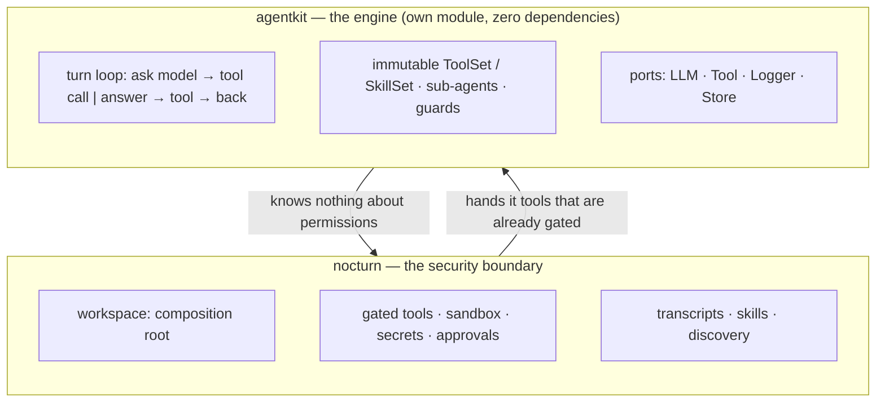

Nocturn is two things in one repository, and the seam between them is the most important line in the
codebase.



## agentkit: the engine

`agentkit` is its own Go module, and its `go.mod` has **no `require` block at all** — not a trimmed
dependency list, none. It contains the loop that drives a conversation: ask the model, get either an
answer or a tool call, run the tool, feed the result back, repeat until the model is done or a guard
stops it.

Everything it touches from outside is a **port**:

| Port | What it abstracts | Who implements it here |
|---|---|---|
| `LLM` | one model turn, streamed | `agentkit/openai` (the only place the OpenAI client appears) |
| `Tool` | something callable, with a schema | nocturn's `internal/tools`, plugins, MCP servers, sub-agents |
| `Store` | where a transcript lives | nocturn's `internal/chat`, or an in-memory one for tests |
| `Logger` | structured logging | `slog`, or nothing |

A few properties fall out of that shape and are worth naming:

- **Sets are immutable.** A `ToolSet` is built once and never mutated, so nothing can inject a tool
  into a running session.
- **A sub-agent is just a tool.** Delegation needs no special case in the loop — the sub-agent is
  wrapped as a `Tool`, so guards, budgets and gating apply to it like anything else.
- **Guards are per turn and per tree.** Step count, token budget, depth, spawn count, wall clock —
  each is a bound with its own error, so a runaway stops for a reason you can read.

## The part that matters for security: it is policy-blind

`agentkit` has no concept of a permission. There is no `if allowed` anywhere in the loop, because
there is nothing there to ask.

Gating happens **outside** it, in `agentkit/gate`, which wraps a tool:

```go
gated := gate.Wrap(tool)   // check {Kind, Target}, then call — or refuse
```

By the time the loop sees a tool, the check is already part of what calling it means. The model can
choose *which* tool to call; it cannot choose to call one without its check, because the unchecked
version is not in the set.

This is why the separation is load-bearing rather than tidy. If the gate lived inside the loop, then
every change to the loop would be a change to the security boundary, and a bug in prompt handling
could become a bug in permissions. It does not, and it cannot.

## nocturn: the boundary

Everything that decides, isolates or persists lives on the nocturn side:

- the **sandbox** (wazero, guest at zero authority) and the **script runtime**,
- the **secrets** vault and the host-side injector, with its bidirectional leak scanner,
- the **gated tools** themselves — each owning its kind constant and target matcher,
- **approvals** out of band, and the device registry behind them,
- **transcripts**, **skills**, **discovery** — the things agentkit deliberately leaves to its
  consumer,
- the **workspace**, which composes all of the above into a session.

## Why it is built to leave

`agentkit` is destined for its own repository. That is not a plan for later so much as a constraint
on now: nothing nocturn-specific may leak into it. No permission model, no workspace layout, no
notion of a phone. The discipline pays off twice — the engine stays reusable, and the security
boundary stays a boundary rather than a habit.

The sibling modules mirror the same rule, each depending only on what it must:

| Module | Depends on |
|---|---|
| `agentkit` | nothing |
| `agentkit/gate` | agentkit |
| `agentkit/tools` | agentkit + gate |
| `agentkit/runtime` | agentkit + gate |
| `agentkit/openai` | agentkit + the OpenAI client |
