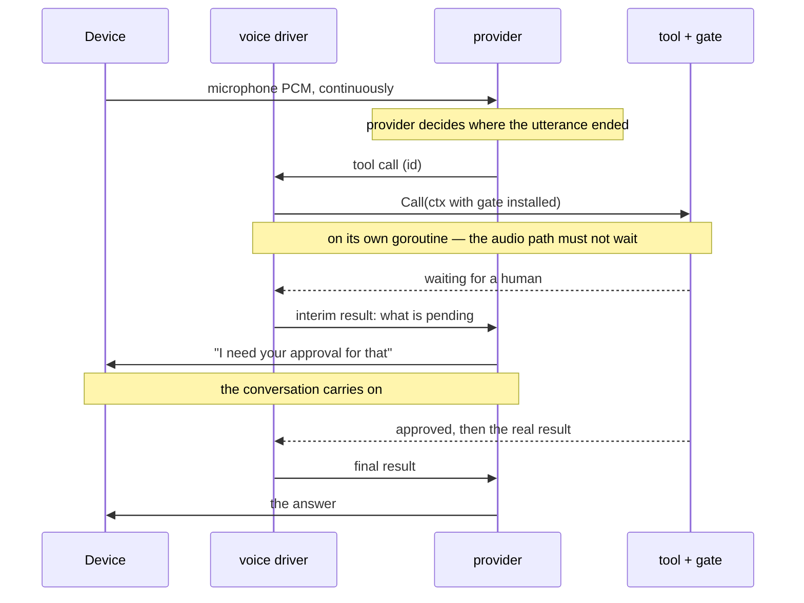

:::caution[This part moves]
The design below is built and tested, but it is the newest thing in the tree and the least settled.
Interfaces, the wire messages, and which actions a spoken session asks about should all be expected
to change.
:::

Typing and speaking are not the same conversation in a different font. A typed turn has a
beginning, an end, and a moment where somebody deliberately pressed send. Speech has none of those,
and every difference in this part of the codebase follows from that.

## Two ports, not one

Nocturn's normal engine is a turn loop: the session asks the model, the model answers or calls a
tool, and around that goes again. That shape is the `LLM` port, and its whole contract is one
request and one response.

A live model has no such boundary. Audio flows in continuously, audio flows out continuously, and
where one utterance ends is decided by the provider listening for a pause — not by the client. So
live speech is a **separate port**, `LiveLLM`, rather than a widened `LLM`:

```
LLM       Next(conv, tools) → answer | tool calls          one turn, then return
LiveLLM   Open(conv, tools) → SendAudio / Events / …       a stream, until closed
```

Widening the first would have meant a turn-shaped API pretending to be a stream. Instead the two
sit side by side, and the pieces a stream needs — audio transport, barge-in, a wall-clock budget —
belong to whoever drives it, not to the turn loop.

What does *not* change is everything below: the same `ToolSet`, the same gate, the same grants, the
same persona. A tool set is a map from name to tool, and gating is a decorator that reads its policy
from the context. Neither ever required a turn loop to drive them, so speech reaches the tools
through the same door as a typed message — a narrower door, as the
[threat model](/architecture/threat-model/#a-microphone-has-no-authenticated-input) explains, but
the same one.

## The flow



Speech in, speech out; the driver in the middle owns the timing.

## Why a waiting tool must not stop the conversation

This is the part that decides whether out-of-band approval works at all when the interface is a
voice.

A provider pauses the whole model while a tool call is outstanding. That is a sane default for a
fast lookup and useless for a gated one: an approval that travels to a phone takes as long as a
person takes, and the conversation would simply stop — no explanation, no way to ask what is
happening, not even the ability to hear that a question was asked.

Dead air is not merely rude here. It is what teaches somebody to grant a permission permanently
just to make the pauses stop, and a reflexive approver is worth less than no approver at all.

So three things happen at once:

1. **The call runs concurrently.** The driver dispatches each tool on its own goroutine, so the
   audio path never waits on one.
2. **The declaration is non-blocking.** The provider is told up front that a call may take a while
   and that generation should carry on. This is a per-provider capability, and the section below is
   about what happens when it is missing.
3. **The wait explains itself.** The driver answers the call with an *interim* result naming what is
   pending, so the model can say what it is waiting for instead of guessing.

That third point is subtler than it looks. From the model's side a pending call is opaque: it knows
it called something and that nothing came back, but not why. Waiting on a slow server and waiting on
a human holding a phone are indistinguishable to it — so an assistant told to explain the wait has
to invent a reason, and inventing "check your phone" when nothing is pending there is worse than
saying nothing.

The reason has to arrive as **an answer to the call**, not as words in the conversation. Injected
text counts as somebody speaking: it interrupts the model mid-sentence and makes it abandon what it
was saying, which is precisely the rudeness the explanation exists to prevent.

## Timing, once the answer arrives

Correlation is not timing. A provider matches a result to its call by id however long it takes — but
an answer that arrives two subjects later should not cut into whatever is being said now. Somebody
asked about a file, moved on to the weather, and having the file contents land on top of the weather
is worse than a short wait.

So the driver counts the turns that pass between a call and its answer:

| | |
|---|---|
| No turn passed — they are still waiting | interrupt with the answer |
| A turn passed — they have moved on | wait for a gap |

Lateness decides this, not the outcome. A denial somebody is still waiting on should interrupt; a
success they have long forgotten should not.

## The model has to support it

**A live model without asynchronous function calling cannot do any of the above.** Its function
calls are sequential: the model stops until the result arrives, and no amount of client-side
concurrency changes that, because the pause is on the far side. Every approval becomes dead air.

This is a per-model property, not a per-provider one — two models from the same vendor differ — and
it is not visible until a gated call actually blocks. Check it before choosing a model, because
everything the voice cage is for depends on it.

Model availability is also worth checking against the account rather than the documentation:
provider docs describe models that a given API tier may not offer at all, and the reachable set
differs between a vendor's consumer and enterprise front doors. Ask the provider what it has.

## Barge-in and withdrawn calls

When somebody talks over the assistant, the provider cancels what it was generating and says so.
Anything the client has buffered but not yet played is now stale, so the driver tells the device to
drop it — otherwise the speaker finishes answering a question that was already abandoned.

A provider may also **withdraw tool calls** it has discarded. When that happens the driver cancels
that call's context, which unwinds the tool and any gate check underneath it together, and sends no
answer for it.

That last part is security-shaped rather than tidy: an approval nobody is waiting for any more
should not still be sitting on somebody's phone, and it must never grant authority for a call that
no longer exists.

## What a session leaves behind

Providers that transcribe both sides hand back the conversation as text, so a spoken session is
persisted as an ordinary chat — readable afterwards on a phone, and continuable by typing. No
separate speech recognition is involved; it is the same transcript store every other conversation
uses.

One thing is deliberately *not* kept: a barge-in discards the model's half-spoken reply while
keeping what the person said. The interruption cut the answer, not the question.
