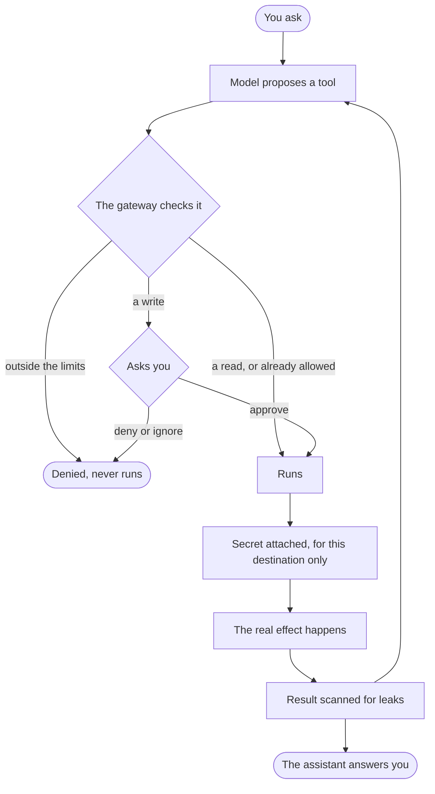

This page follows a single action all the way through Nocturn. Say you ask the assistant
to send an email. Here is what happens between your message and the email actually going
out.

## Step by step

**You ask.** You type a request, or a scheduled agent starts on its own. The model reads
the request and decides what to do.

**The model proposes a tool.** It does not act. It proposes: "send an email to this
address". That proposal is untrusted. On its own it does nothing.

**The gateway checks.** Every proposal meets the same door. The gateway checks it in
order. First the hard limits: is this even within the agent's reach? If not, it is denied
outright, with no prompt. Then the policy: reads run, writes ask. Then your standing
permissions: did you already allow this? If so it goes straight through. Otherwise it asks.

**You approve.** For anything that changes the world, the assistant waits for your yes.
The prompt shows what it wants to do in plain words, with the real target underneath so you
cannot be misled. You can allow it once, for the session, or always. If you deny or ignore
it, nothing happens.

**The secret is attached.** Only after approval does Nocturn add the credential, at the
boundary, for this destination only. The assistant never held it.

**The effect happens.** The email is sent. This is the first moment anything real occurs.

**The result is scanned.** What comes back is checked for leaks and cleaned before the
model sees it, so untrusted content cannot smuggle a secret into the assistant's context.

**Back to the model.** The result returns to the loop. The model may propose another tool,
and the cycle repeats, or it writes your answer.

## The one idea

There is exactly one door. The model, a plugin, and an MCP server all reach it the same
way, and all meet the same checks. There is no path around it. That is what makes
the assistant's behavior something you can reason about: every real action passed the same
gate, and every action that mattered passed you.
