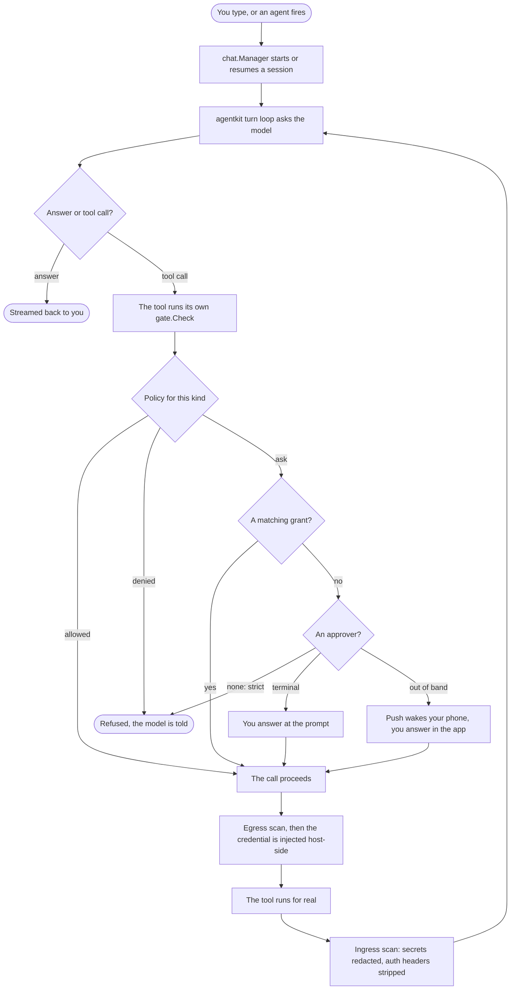

Say you ask the assistant to post something to an API. Here is everything between your message and
the request actually leaving the machine.

## Step by step

**You ask.** A message in the terminal, or a cron firing. `chat.Manager` starts a new session or
resumes the one you addressed, over a file-backed store — the transcript is a folder, not a
database.

**The loop asks the model.** `agentkit` sends the conversation to the model adapter, which streams
back tokens, reasoning and — when the model wants to act — a native tool call. Nothing has happened
yet: a tool call is a *proposal*, and it is untrusted, because whatever the model read to get there
may have been hostile.

**The tool checks itself.** The proposal reaches a tool that has already been wrapped for this
workspace. Its first act is `gate.Check` with its own kind and target — `net → api.example.com`,
`file → notes/todo.md`. A tool that carries no authority (reading a workspace file, asking the time)
skips this, because there is nothing to decide.

**The policy rules.** For `net` and `file` the workspace policy says *ask, and remember for the
session*. For everything else it says *allowed*. This is a standing rule per kind, not a judgement
about the sentence that led here.

**Grants are consulted.** If you have already allowed this kind and a target that matches — with
the tool's own matcher, so `*.example.com` covers the subdomain and `notes/*` covers the file — it
goes straight through, no prompt.

**Someone is asked.** Otherwise the approver is called. In the terminal that is the inline prompt.
For an agent set to `guarded`, it is your phone: a push wakes the device, the question is delivered
over the authenticated connection, and the run waits — up to two minutes, after which silence is a
no. With no approver at all (`strict`), the ask is denied and the model is told so it can adapt.

**The credential appears — and not before.** After the decision, at the boundary, the host stamps in
the credential bound to that destination. The guest never held it and could not have chosen it. On
the way out, the request is scanned: if it carries a secret the vault knows, it is blocked *before*
the host's own credential is added.

**The tool runs.** This is the first moment anything real occurs.

**The answer is scanned coming back.** Response bodies and headers are checked; an echoed secret is
redacted and credential-bearing headers (`Set-Cookie`, `Authorization`, …) are stripped. Then the
result goes back into the loop as an ordinary tool result, and the model either acts again or
answers you.

## The one idea

Every path leads to the same check. The model calling a tool, a script calling `nocturn.call`, a
plugin's `fetch`, an MCP server's POST — all of them arrive at a tool that gates itself, with the
same kinds and the same grants. There is no second door and no bypass, because the ungated version
of a tool is not something any of them can reach.

And the decision that matters most does not live where the attack does: it lives on the device in
your pocket.
