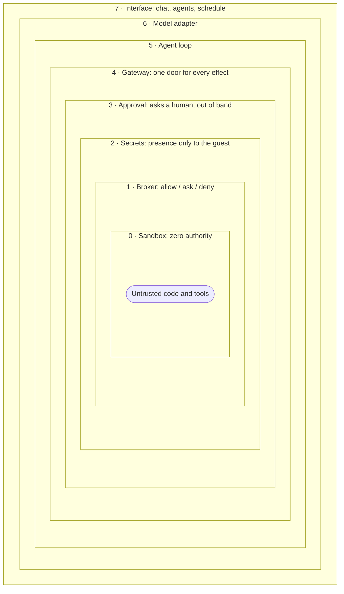

Nocturn is built in layers, like an onion. Each layer rests on the one inside it, and each
was made solid before the next was added. The layers closest to the center are the
smallest and the most trusted. The further out you go, the more convenience you add, but
the security never depends on the outer layers being careful. It is enforced at the core.

Convenience lives on the outside, authority at the core. Here are the same eight layers,
from the inside out.

## 0. The sandbox

At the center, untrusted code runs with no power at all. It gets no files, no network, no
way to reach your machine. A capability it was not handed is simply not there. This is the
ground the rest stands on: nothing can act until something above deliberately hands it a
way to.

## 1. The broker

Every possible action passes one decision point. The broker answers a single question:
allow, ask, or deny. It denies by default, and a deny always beats an allow. Reads are
allowed, writes ask. Reach is limited to a specific target, so "allowed to fetch" never
means "allowed to fetch anything".

## 2. Secrets

Keys and tokens live in an encrypted vault. The parts of the system that could be tricked
never see a secret's value, only that one exists. Nocturn attaches the real secret at the
last moment, and only to the destination it belongs to.

## 3. Approval

When the broker says "ask", the question goes to a human. It can go out-of-band, to your
phone, so an action waits for a real person on a second device. This is the layer that
stops a hijacked assistant, because the decision lives somewhere the hijack cannot reach.

## 4. The gateway

The gateway ties the inner layers together into one check. For any action it lines up the
limits, the policy, your standing permissions, and the approval, in that order, and only
then lets the action through. It is the single door every effect goes through.

## 5. The loop

Above the gateway sits the agent loop. It asks the model what to do, runs the tools the
model chooses, and feeds the results back. It never touches an effect directly. Every tool
it runs goes through the gateway below.

## 6. The model

A thin adapter talks to the AI model. Swapping models is a change here and nowhere else.
The model's keys live on this side, never inside the sandbox.

## 7. The interface

At the outside is what you touch: the chat, agents, and the schedule. This is the most
convenient layer and the least trusted. It can start work and show results, but it cannot
grant power. That still belongs to the core.

## Why build it this way

Each layer does one job and can be checked on its own. Convenience lives on the outside,
authority on the inside. An attacker who reaches an outer layer still meets every inner
gate, so a mistake up top cannot become a breach down below. The
[request flow](/architecture/request-flow/) follows a single action down through these
layers and back.
