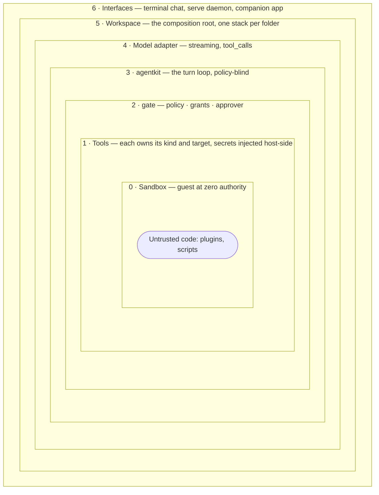

Nocturn is built so that the parts which can be talked into something are the parts with the least
power. Convenience lives on the outside; authority is handed inward, explicitly, one window at a
time.

## 0 · The sandbox

A wazero guest with nothing: no filesystem, no network, no clock, no environment. Not "denied" —
absent. Every capability it has is a host function someone deliberately handed it, which is why the
absence of one is unforgeable. Memory is capped and a wall-clock deadline traps runaways.

For the JavaScript runtime there is exactly **one** import: `nocturn.call`. That is the entire
surface between untrusted code and the world.

## 1 · The tools

A tool is a Go function with a schema. This is where something actually happens to the world, and
where the check for it lives: each gated tool calls `gate.Check` with **its own** kind and its own
notion of a target — the host for network tools, the path for file writes.

Two things about this layer are easy to get wrong:

- Not every tool checks. The file reads do not; they rely on being **rooted** at `mnt/`, which is a
  stronger guarantee than a prompt.
- Secrets never travel outward. A credential is stamped in here, at the boundary, for the matching
  destination — the layers above never hold it.

## 2 · The gate

`gate.Check` turns an `Action{Kind, Target}` into a ruling: allow, ask, or deny. Three pieces
decide, in order:

1. the **policy** — the workspace's standing rule per kind;
2. your **grants** — answers you chose to remember, matched with the tool's own matcher;
3. the **approver** — a human, on the terminal or out of band.

Recall is deliberate: `RecallNever` is the zero value, so a forgotten field never means "remember
forever".

## 3 · agentkit

The turn loop: ask the model, get an answer or a tool call, run the tool, feed the result back.
It knows **nothing** about permissions — there is no allow/deny concept in it at all. It is a
separate module with zero dependencies, built to leave for its own repository.

That ignorance is the design. The gate is a wrapper *around* tools, so the loop cannot skip it, and
a change to how prompts are handled can never become a change to what is permitted. See
[the two halves](/architecture/agentkit/).

## 4 · The model adapter

One small package speaks the provider's dialect: streaming tokens, reasoning, native tool calls.
Swapping providers is a change here and nowhere else. The API key lives on this side and never
enters the guest.

## 5 · The workspace

The composition root. For one folder it assembles the tool set (the cage), the gate (policy, durable
grants, approver), the persona, the chat store, the agents, the plugins, the MCP servers — and hands
the result to a session. Two workspaces share nothing but the process and the master key they each
derive their own vault key from.

## 6 · The interfaces

The terminal chat, the `serve` daemon, and the companion app. The most convenient layer and the
least trusted: it can start work and show results, but it cannot grant power. An approval shown in
the app is *transported* by this layer, never *decided* by it — which is exactly why the decision is
allowed to live on a second device.

## Why this order

Each layer can be checked on its own, and the inner ones do not depend on the outer ones behaving.
Something that hijacks the conversation is operating at layer 3 and above; it still meets the gate
at 2, the tool's own bounds at 1, and a guest with no authority at 0. A mistake at the top cannot
become a breach at the bottom.

The [request flow](/architecture/request-flow/) follows one real action down through these layers
and back.
