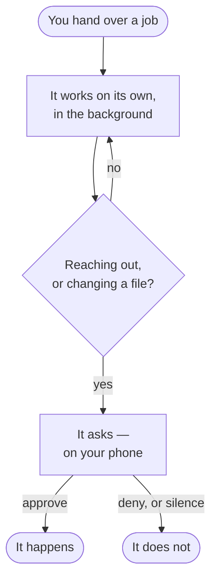

Nocturn runs autonomous AI agents for you. You give an agent a job and let it work: on a
schedule, in the background, on its own. When it wants to do something that matters, like
send a message, spend money, or change a file, it pauses and asks you. You can approve or
deny right from your phone.

That's the whole idea:

> Let agents work. Approve only what matters.

The loop back to the top is the part that runs without you. The one branch that leaves it is the
only part that needs you — and it is the reason you can leave the rest alone.

A quick word on terms. The **assistant** is Nocturn itself, the thing you talk to. An
**agent** is a specific job you set up for it to carry out, either on demand or on a
schedule. You will see both words throughout these guides.

The chat you get on first run is where you try things out and shape an agent. The real value comes
later, from agents that keep working when you are not watching and only interrupt you when a
decision is genuinely yours to make.

## Why it's built this way

An agent working on its own reads things you do not control: web pages, emails, incoming
messages. Any of those can hide instructions that try to hijack it into misusing the access
you gave it. Nocturn assumes this will happen, so it puts a gate in front of every real
action. A hijacked agent still cannot reach the network or your files without your explicit
yes — the gate asks by *reach*, not by how dangerous a call looks, so there is no clever
framing that makes a request exempt. And because that yes lives on a second device, it is
still asked when nobody is watching the conversation.

## Two ideas to understand first

Everything else follows from these two.

### The workspace is the agent's whole world

An agent lives in a workspace, a single folder. Inside it, one directory named `mnt/` holds every
file the agent can see and touch. Its notes, its files and its data live there, and nothing else on
your machine is reachable — not because a rule forbids it, but because the file tools are rooted at
that directory and a path leaving it is an error. Reaching the internet is a separate matter, and
that one always asks.

The workspace is also your entire setup. There is no hidden database. Copy the folder and
you have copied everything: the data, the permissions, the connected accounts, the agents,
and the skills. It is portable and versionable by design. Check it into git, back it up,
move it to another machine. [Learn the workspace](/nocturn/guides/the-workspace/).

### You stay in control through approval

Agents do not get blanket permission. Reaching a host on the network asks — reading included, since
the reach is the risk — and so does changing a file. Reading inside the workspace does not, because
there is nowhere for it to reach. You answer once, for the session, or always, and what you answer
is about a specific target, never a tool in general.
[Learn about approvals](/nocturn/guides/approvals/).

## It runs on your machine

One program. No cloud account, no database, nothing to install alongside it. Download it,
point it at an AI model, and it is yours.

## Get going

- [Get started](/nocturn/guides/getting-started/): run it and send the first message.
- [The workspace](/nocturn/guides/the-workspace/): the agent's isolated, portable world.
- [Agents](/nocturn/guides/agents/): put one to work in the background.
- [Approvals](/nocturn/guides/approvals/): approve from your phone.
