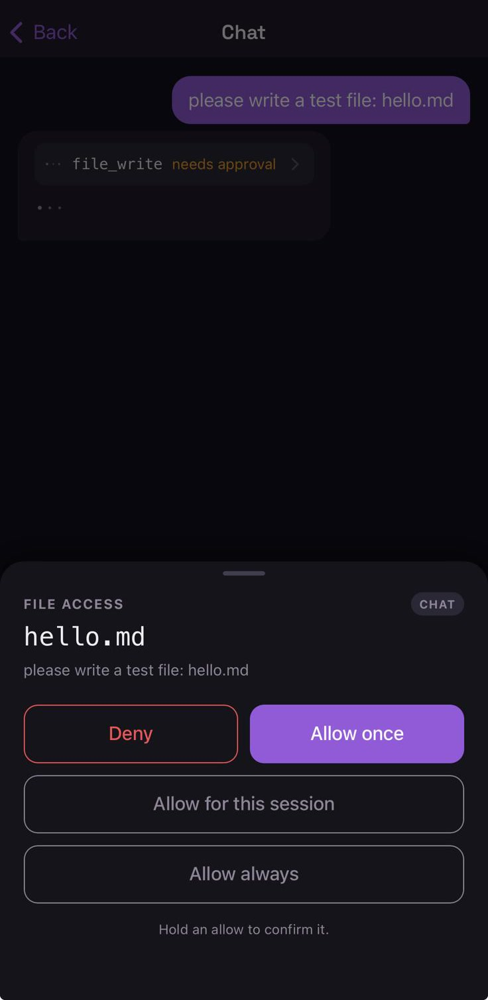

The app is not a remote control for the terminal. It is the **second device**, and it is the reason
Nocturn's approvals mean anything at all.

An assistant that asks permission *inside the conversation* asks in the same place a
[prompt injection](/nocturn/architecture/threat-model/) already sits — and worse, it asks at a
terminal that, for the runs this is built for, nobody is sitting at. Moving the question to a device
of its own gives it an audience and a screen the conversation does not write. Everything else the
app does — reading chats, firing agents, checking reminders — is convenience layered on that one
job.

## Getting it

  <figure style="margin:0;text-align:center;">
    
    <figcaption><a href="https://testflight.apple.com/join/TdMWnxYF">Public beta</a></figcaption>
  </figure>
  <figure style="margin:0;text-align:center;">
    
    <figcaption><a href="https://github.com/efuturetoday/nocturn/releases/latest">Latest release</a></figcaption>
  </figure>

**iOS** goes through TestFlight — Apple has no sideloading, so there is nothing to download here.
**Android** is an APK on the latest release; it is debug-signed, so Android warns about an unknown
source. One codebase builds both: Angular under Capacitor, with the push transport as the only real
difference.

You can also build it yourself from `mobile/` in the repository; the README there has the steps.

No nocturn of your own yet? Tap **Enter server manually** on the first screen and enter `demo` as the
host — sample data, held entirely on the device, and enough to see what an approval looks like.

## Pairing

Nocturn has to be running: `nocturn serve`. The app finds it on your network over Bonjour, so
you do not type an IP.

- **The first device** redeems a bootstrap code the server prints at startup.
- **Every device after that** asks an already-paired one, and the code appears *there* — you read it
  on a device you already trust and type it on the new one.

A device merely on your network cannot join. It needs a human at a device you already trust.

The full flow, including devices with no screen to show a code, is in
[remote access](/nocturn/guides/remote-access/).

## What it does

| | |
|---|---|
| **Approvals** | the point — an ask, what it would reach, approve or deny |
| **Chats** | every conversation, streamed token by token, shared with the terminal |
| **Agents** | the scheduled agents in a workspace, and firing one by hand |
| **Reminders** | what the assistant has been asked to bring back to you |
| **Pairing and joins** | approving the next device |
| **Discovery** | finding servers on the network |

Conversations are **not per device**. Start something in the terminal, pick it up on the phone,
finish it in the terminal again. And when two devices are shown the same approval, **the first
answer wins** — the other is told it was resolved rather than asked twice.

## Seeing what a turn actually did

Every assistant turn that used tools carries one chip above the answer, naming them. Nothing runs
invisibly here either — the chip is there whether or not the answer mentions it.

Tapping the chip opens the turn's tools, each expanding to the arguments it was called with and the
result it returned:

## Approvals when you are nowhere near it

This is the case the server exists for. An agent runs on a schedule, hits something that needs your
yes, and there is no terminal in front of it. A push wakes your phone, you decide, the run continues
or stops.

The push carries **no authority** — it wakes the app, and the decision travels back over the
authenticated connection, never inside the notification ([why, and what it costs an
attacker](/nocturn/guides/remote-access/#approvals-when-nobody-is-looking)). That is also what will
make a hosted relay safe to run later: a relay learns that some device should look at its server, and
nothing about what was asked or how you answered.

Push over the internet currently needs your own Apple Developer account and the four
`NOCTURN_APNS_*` variables. Without them everything still works on your own network — you simply are
not woken while the app is closed.

With no paired device at all, an agent set to `guarded` behaves as `strict`: the ask is denied and
the run reports why. Missing setup reduces authority; it never grants it.

## What it deliberately cannot do

The app is a device with a **class**, and the class decides what it may do — not a list of
permissions stored somewhere. An `app` may answer approvals and enrol other devices. An `appliance`
— a voice satellite, anything with no authenticated input — may do neither, and is never even
attached to the approval broker, so there is nothing for it to answer *with*.

A device may only enrol a class whose abilities its own class already covers. A stolen speaker
therefore cannot multiply into a household of equally trusted microphones.
