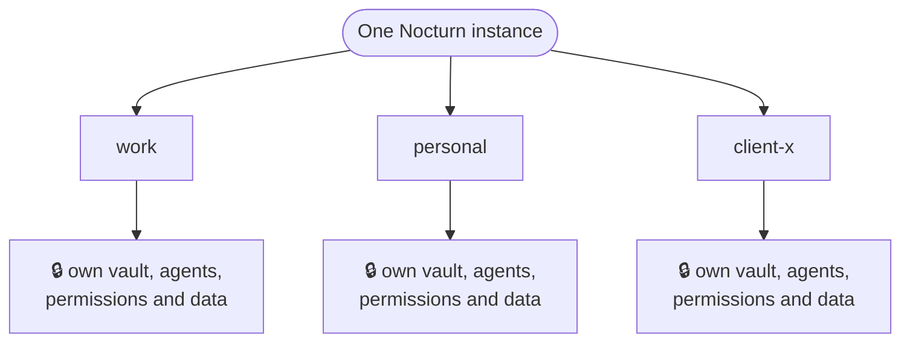

The workspace is the most important idea in Nocturn. Understand this one and the rest
follows.

Everything an agent is — the data it works with, the accounts it can use, the permissions
you have granted, and the agents, skills, and plugins themselves — lives in a single
folder: its **workspace**. There is no database and no hidden state. **The folder is the
whole thing.**

And you can have more than one. A workspace for work, one for personal life, one for a
client project — each a self-contained world that knows nothing of the others. One Nocturn
runs them all at once, yet they never mix.



That isolation is the heart of the idea, and it works on two levels: an agent is walled
inside its workspace, and each workspace is walled off from the others. The rest of this
page follows that one thread.

## Inside one workspace

Zoom into a single workspace and it is just a folder on disk. One directory inside it,
`mnt/`, is the agent's entire visible world; everything alongside it is yours to manage and
invisible to the agent.

```
workspaces/work/
├─ mnt/            ← the ONLY thing the agent sees, its whole world
│  ├─ inbox.txt
│  ├─ notes/
│  └─ summary.md
│
│  ── everything below is yours, and invisible to the agent ──
├─ PERSONA.md      ← the assistant's persona (its system prompt) — optional
├─ secrets.vault   ← encrypted vault (connected accounts, tokens)
├─ grants.json     ← the standing permissions you have granted
├─ mcp.json        ← remote MCP servers you have connected
├─ agents/         ← the agents defined in this workspace
├─ skills/         ← bundled know-how
└─ plugins/        ← installed capabilities
```

A single workspace can hold several agents. They share this one folder — the same `mnt/`
data and the same connected accounts. What each agent keeps to itself is its own
instructions, its own list of allowed tools, and its own permissions.

## The first wall: the agent lives in `mnt/`

The agent is handed a view of `mnt/` and nothing else. Its files, notes, and working data
all live there, and it can read and write only inside it. It cannot see or touch anything
outside.

This is not a rule the agent is asked to follow — it is structural. There is nothing to
escape, because the rest of your disk was never in its world to begin with. A hostile
instruction cannot send it wandering through your home directory.

The same wall protects the workspace's own settings. Everything below `mnt/` — the vault,
the permissions, the agent definitions — is the control plane you manage, and it sits
outside the agent's view. So a hijacked agent cannot read its own permissions file to grant
itself more, and cannot rewrite its own instructions, because those files are not in its
world.

## The assistant's persona

Who the assistant *is* — its tone, its standing instructions, the way it approaches your
work — is its **persona**: the system prompt it carries into every conversation. Drop a
`PERSONA.md` in a workspace to set it, and this workspace's assistant follows it from then
on. It is optional; without one, a careful built-in default is used.

The persona resolves in layers, first match wins — so a shared house style can sit above
per-workspace overrides:

```
workspaces/PERSONA.md        ← a shared default for every workspace
workspaces/work/PERSONA.md   ← this workspace's own persona (overrides the shared one)
(no file)                    ← the built-in default
```

Like the permissions and the agent definitions, `PERSONA.md` lives in the control plane —
outside `mnt/`. The assistant reads it but cannot see or rewrite it, so a prompt injection
cannot quietly rewrite the assistant's own identity.

Child agents are different: each carries *its own* instructions (see
[Agents](/guides/agents/)) and does not inherit this persona — a focused worker is defined
entirely by its own brief.

## The second wall: workspaces cannot see each other

Now step back out to several workspaces. The wall between them is made the same way — by
construction, not by a policy the agents are trusted to respect.

Each workspace has its own vault, its own permissions, and its own view of the world. The
`work` agent is handed `work`'s accounts and `work`'s tools; it has no path to `personal`'s,
because they are simply not in its hands. A prompt injection that hijacks an agent in one
workspace cannot reach into another's secrets — there is nothing there to reach.

One convenience does span all of them: a single **master passphrase**, entered once at
startup, unlocks every workspace's vault. Yet no two vaults share a key — each is derived
from the master for that workspace alone. So you remember one secret, not one per
workspace, and the walls still stand.

## Working with several at once

Because one Nocturn runs them all, using several is light:

- Start on a particular one with `nocturn <name>` (a fresh name is created on first run).
- Every workspace under `workspaces/` is loaded together, and each one's scheduled agents
  run side by side, each through its own walls.
- In the chat, `/ws` lists your workspaces and `/ws <name>` switches the one you are talking
  to.
- When a background run in another workspace needs your approval, the prompt is tagged with
  its workspace — `[work] Send the weekly summary?` — so you always know which world is
  asking before you say yes.

## A folder you own and move

Because the folder is the entire state, a workspace behaves like any other project folder:

- **Copy it** to another machine and the agent comes with it — same memory, same
  permissions, same abilities.
- **Version it** with git to track how it changes and roll back mistakes.
- **Back it up** by copying one directory.

An agent is not tied to the machine it was born on. It is a folder you own and move around.

:::note[One secret stays out of the copy]
The vault (`secrets.vault`) is encrypted with your master passphrase. Copying the folder
copies the locked vault, and the tokens inside cannot be read without you. See
[Connecting accounts](/guides/connecting-accounts/).
:::

The only thing that lives outside every workspace is `.env`, the small file that holds your
model connection. It sits next to the program, not in any workspace, so remember it
separately when you move a workspace to another machine.
