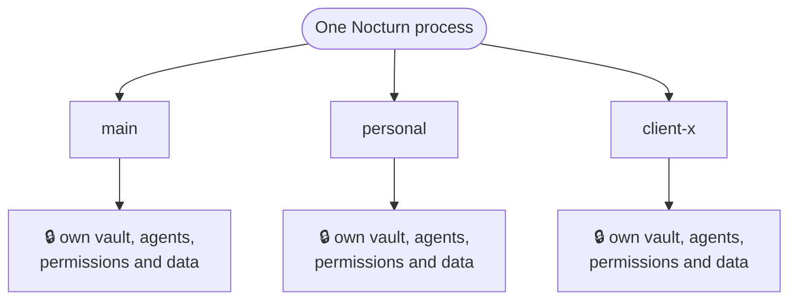

The workspace is the most important idea in Nocturn. Understand this one and the rest follows.

Everything the assistant is — the data it works with, the accounts it can use, the permissions you
granted, the agents, skills and plugins themselves — lives in a single folder: its **workspace**.
There is no database and no hidden state. **The folder is the whole thing.**

And you can have more than one. One for work, one for personal life, one for a client — each a
self-contained world that knows nothing of the others. One Nocturn process runs them all at once,
yet they never mix.



That isolation works on two levels: the assistant is walled inside its workspace, and each workspace
is walled off from the others.

## Inside one workspace

A workspace is a folder under `nocturn-data/workspaces/`. One directory inside it, `mnt/`, is the
assistant's entire visible world; everything alongside it is yours.

```
nocturn-data/workspaces/main/
├─ mnt/            ← the ONLY thing the file tools can reach
│  ├─ inbox.txt
│  ├─ notes/
│  └─ summary.md
│
│  ── everything below is the control plane, out of the assistant's reach ──
├─ PERSONA.md      ← the assistant's system prompt for this workspace — optional
├─ vault.enc       ← the encrypted workspace vault
├─ grants.json     ← the permissions you chose to remember
├─ reminders.json  ← pending reminders
├─ chats/          ← your conversations
├─ agent-runs/     ← transcripts of background agent runs
├─ agents/         ← one folder per agent, each with an agent.md
├─ skills/         ← one folder per skill, each with a SKILL.md
├─ plugins/        ← one folder per plugin, each with a plugin.json
└─ mcp/            ← one folder per remote MCP server, each with an mcp.json
```

`vault.enc` is the workspace's own credentials; plugins and MCP servers additionally keep a
`secrets.enc` shard inside their own folder, which is why moving or renaming one of those folders
makes its old secrets unreadable. How that is keyed, how to put a value in, and why the model never
sees one is all on [the vault](/nocturn/guides/vault/) — that page is the single source of truth for
credentials, and this one only says where the files sit.

`nocturn ls` shows a workspace's plugins, servers, agents and skills.

## The first wall: the file tools see only `mnt/`

The file tools are rooted at `mnt/`. Not "asked to stay there" — rooted, so there is nothing to
escape: a path that would leave it is a hard error before any permission question is even asked.

That is also what protects the workspace's own settings. `grants.json`, `vault.enc`, `agents/`,
`PERSONA.md` and the chat transcripts sit **outside** `mnt/`, so a hijacked assistant cannot read
its own permissions to widen them, cannot rewrite its own instructions, and cannot read back your
conversations. Not because a rule forbids it — because those files were never in its world.

This is why the ungated file reads are defensible: what they can reach is `mnt/`, and `mnt/` is what
you put there.

## The assistant's persona

Who the assistant *is* for this workspace — tone, standing instructions, how it approaches your work
— comes from `PERSONA.md` in the workspace root. Drop one in and it becomes the system prompt for
every conversation in that workspace; leave it out and a careful built-in default is used.

`PERSONA.md` is control plane. The assistant is shaped by it and cannot see or rewrite it, so an
injected prompt cannot quietly redefine the assistant's own identity.

Agents are different: each carries its own brief and does not inherit the persona — a focused worker
is defined entirely by its own instructions. See [Agents](/nocturn/guides/agents/).

## The second wall: workspaces cannot see each other

Each workspace has its own vault, its own grants, its own tools. The `main` assistant holds `main`'s
accounts; there is no path from it to `personal`'s, because they are not in its hands. An injection
in one workspace cannot reach another's secrets — there is nothing there to reach.

One convenience spans them: a single **master passphrase**
(`NOCTURN_MASTER_PASSPHRASE`) unlocks every workspace's vault. No two vaults share a key — each is
derived from the master for that workspace alone. One secret to remember, walls intact.

## Working with several at once

- Every folder under `nocturn-data/workspaces/` is opened at startup, and each one's scheduled
  agents run side by side.
- The **terminal chat always talks to `main`.** Other workspaces still run their agents; you just do
  not converse with them from the terminal.
- Subcommands take `-w <name>` — `nocturn ls -w personal`, `nocturn secret ls -w client-x`.
- The [companion app](/nocturn/guides/remote-access/) can list and switch workspaces (`workspace.list`), so
  a second device is the way to talk to more than one.

## A folder you own and move

Because the folder is the entire state, a workspace behaves like any other project folder:

- **Copy it** to another machine and the assistant comes with it — same data, same grants, same
  abilities.
- **Version it** with git to see how it changed and roll back mistakes.
- **Back it up** by copying one directory.

:::caution[Two files live outside the workspace — take them along]
`vault.enc` is encrypted under your master passphrase, so copying the folder copies a locked vault
and the credentials inside stay unreadable without you. But the passphrase alone is not enough to
open it again: the key is `scrypt(passphrase, salt)`, and that salt is in **`nocturn-data/master.salt`**,
one level above every workspace. Copy a workspace without it and the vault is unreadable even with
the right passphrase — the derived key is simply a different one.

`.env`, which holds your model connection, sits next to the binary for the same reason and is the
other thing to remember. See [the vault](/nocturn/guides/vault/).
:::
