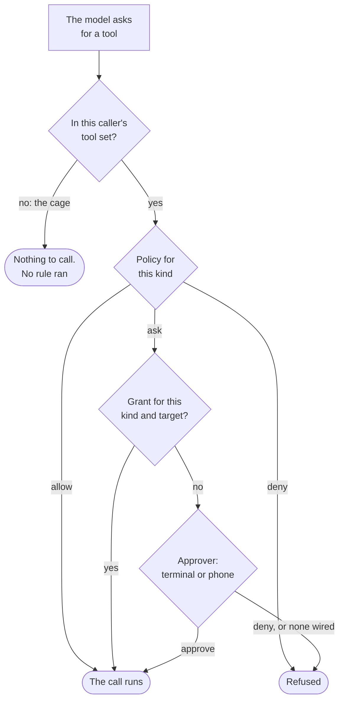

Every permission question in Nocturn is really one of **two** questions, and they are answered by
different machinery. Keeping them apart is what makes the security story small enough to hold in your
head.

| | The question | Answered by | When |
|---|---|---|---|
| **Cage** | *Which tools does this caller have at all?* | the tool set it was built with | once, at construction |
| **Gate** | *May this call do this particular thing?* | `gate.Check(Action{Kind, Target})` | every call |

The cage is not a rule that gets evaluated — it is the absence of a tool. A plugin whose manifest
says `"uses": ["http_read"]` does not have a file tool that is denied; it has **no file tool**. That
is why the cage cannot be argued with by a cleverly worded prompt: there is nothing there to talk
into cooperating.

The gate is the part that can stop and ask you.



Read the two branches out of the first diamond as the two questions: the left one is the cage and it
never runs any code, the right one is the gate and it runs on every single call.

## The five kinds

An action is a `{Kind, Target}` pair. The kind says *what sort of reach* this is; the target says
*where*. There are exactly five kinds in the code, and no others:

| Kind | Target | Tools that check it | Root policy |
|---|---|---|---|
| [`net`](/nocturn/reference/gate/net/) | the **host** | `http_read`, `http_write`, `dns_resolve`, `ping` | **asks**; you choose how long the yes lasts |
| [`file`](/nocturn/reference/gate/file/) | the **path** | `file_write`, `file_remove`, `file_move` | **asks**; you choose how long the yes lasts |
| [`notify`](/nocturn/reference/gate/notify/) | the constant `user` | `notify` | allowed |
| [`remind`](/nocturn/reference/gate/remind/) | the constant `user` | `remind` | allowed |
| [`memory`](/nocturn/reference/gate/memory/) | the **note path** | `memory_write` | allowed in a chat, **asks** in an agent run |

`memory` is the one kind staggered by who is watching. A chat shows the write in its transcript as
it happens, so asking would only buy "before" instead of "after"; an unattended run has nobody
reading, so it asks out of band — and with no device paired, denies.

That table is the whole policy. In code it is two short functions:

```go
// internal/workspace/workspace.go — the workspace root policy
switch a.Kind {
case tools.NetKind, tools.FileKind:
    return gate.AskWith(gate.RecallAlways)
default:
    return gate.Allowed()
}

// ...and the same thing for an unattended agent run, plus one kind
if a.Kind == memory.Kind {
    return gate.AskWith(gate.RecallAlways)
}
return base.Decide(a)
```

Note what it is *not*: it is not deny-by-default. A kind nobody wrote a rule for runs. That is a
deliberate choice for a personal assistant — the tools that exist are few and each was added on
purpose — but it is worth knowing, because tightening it is a decision, not a bug fix.

## Reading and writing are not a rule

You will see a `read` / `write` badge on every tool page. It describes what the tool does — observe
something, or change something. It does **not** decide whether the tool asks. Two examples that
break the tempting "reads are free, writes ask" shortcut:

- `http_read` is a read and **asks every time**. Reaching off the machine is the risk; the HTTP verb
  is not what makes it risky.
- `file_read` is a read and is **not gated at all** — it never calls the gate. Reading inside a
  folder the workspace owns is protected by confinement, not by a prompt.

So each tool page states its gate status directly, and that is the field to trust.

## Ungated is not the same as unbounded

Several tools never call the gate: `file_read`, `file_list`, `file_stat`, `file_search`,
`remind_list`, `remind_cancel`, `time_now`, `wake`, `skill_read`, `skill_load` — and `code_run`
itself. None of them is a hole, because each is bounded by construction rather than by permission:

- the file reads are **confined** — every path resolves against the workspace root first, and an
  escape is a hard error rather than a denied call;
- `time_now` reveals the clock, which the guest does not otherwise have and which gives away nothing;
- `wake` schedules the conversation's own continuation and is **clamped** (1 s … 1 h, capped number
  of pending wakes) instead of asked;
- `skill_read` and `skill_load` add context, never authority;
- `code_run` runs pure computation in a guest with no filesystem, network or clock — every call it
  makes leaves through an ordinary tool and is gated **there**, so a script's reach is exactly its
  caller's cage.

## Grants: remembering an answer

When the gate asks and you say yes, you can have that answer remembered. What gets stored is a
`{kind, target}` pair — never "this tool" and never "this prompt".

`Recall` has three values, and the zero value is the safe one:

| Value | Lives | Written to disk |
|---|---|---|
| `RecallNever` | not at all — this call only | no |
| `RecallSession` | until the process exits | no |
| `RecallAlways` | forever | yes, `grants.json` in the workspace |

**What a policy names is a ceiling, not a decision.** `gate.Check` takes the smaller of the two —
the ceiling the policy allows and what the human actually chose — so `AskWith(RecallAlways)` does
not mean "remember everything forever". It means the person may answer for good, and the approver
may offer that. Answering "just this once" still stores nothing.

A lower ceiling is therefore not the cautious choice it looks like. Both approvers show an *Always*
button; under `RecallSession` it silently resolved to a session grant, and somebody who believed
they had settled a question was asked again the next day. Nothing failed, which is exactly why it
lasted so long. Voice keeps `RecallNever` on purpose — whoever is audible can speak, so a spoken
"always" would be a standing permission granted by a channel that authenticates nobody.

```json
[
  { "kind": "net",  "target": "*.github.com" },
  { "kind": "file", "target": "notes/*" }
]
```

`grants.json` is written `0600` through a temporary file, so a crash mid-write cannot leave a
half-parsed permission file behind. Delete an entry and the next matching action asks again.

The approval prompt offers exactly **one** widening beyond the exact target: the parent domain for a
host (`api.example.com` → `*.example.com`), the containing directory for a path
(`notes/todo.md` → `notes/*`). One step, offered explicitly — never a silent widening.

## When nobody can be asked

An agent running on a schedule has no human in front of it. That case is handled by the agent's
autonomy setting, and the zero value is the strict one:

- **`Strict`** — no approver is wired at all. A fresh ask is **denied**, and the agent reports why.
- **`Guarded`** — the ask is routed out of band: your phone, over the [companion
  app](/nocturn/guides/remote-access/).

With no device paired, `Guarded` collapses back to `Strict`. A missing setting, a typo'd setting, a
device you never set up: all of them fail toward *less* authority, never more.

## Where this is enforced

The gate is a **wrapper**, not a feature of the engine. `agentkit` — the turn loop that drives the
model — knows nothing about permissions; `gate.Wrap` puts the check between the model's decision and
the tool running. That separation is deliberate and load-bearing: the part that talks to the model
cannot decide to skip the part that asks you. See [the two halves](/nocturn/architecture/agentkit/).
